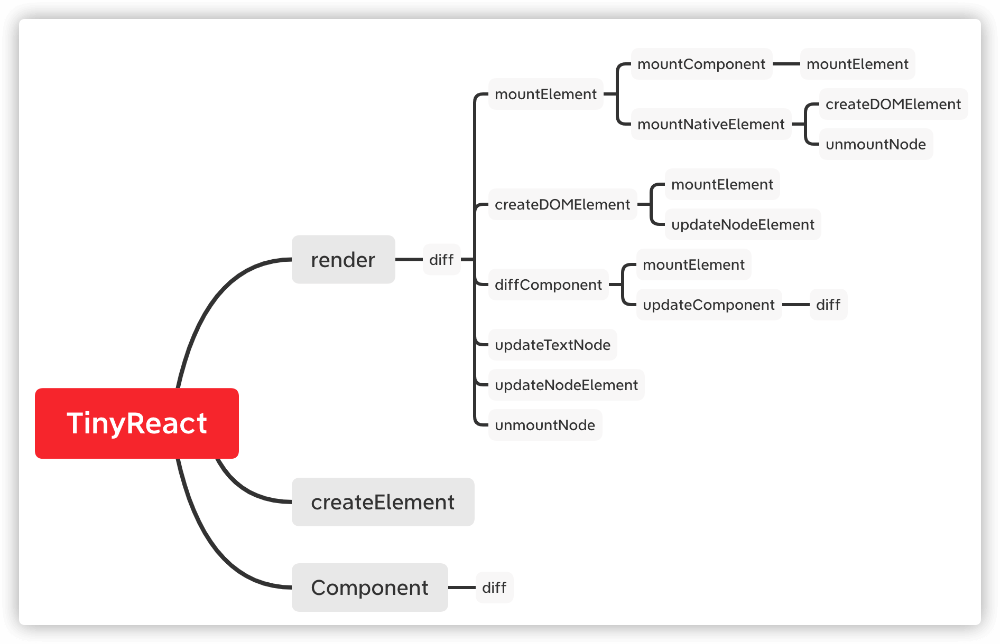
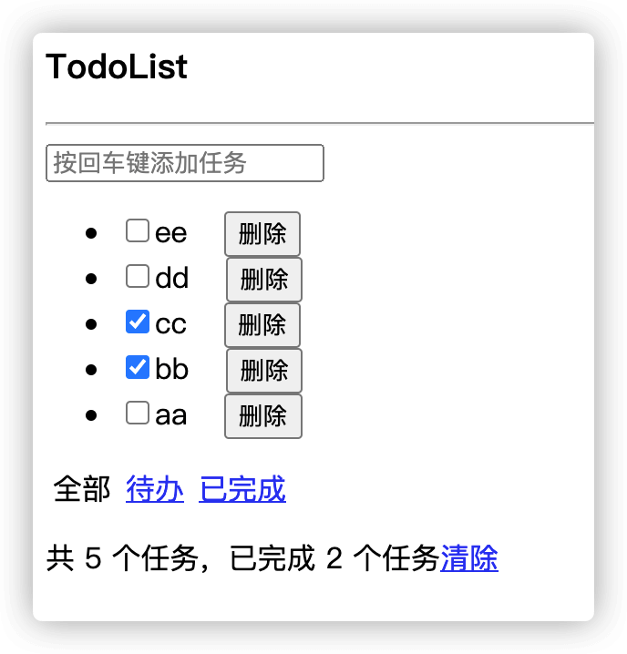

# TinyReact

为了学习 React 底层原理，模仿 React 功能开发的小型库，以及一个用于测试的 TodoList。

## 项目启动说明


```sh
# 安装依赖
$ npm install

# 运行项目
$ npm start
```

运行项目后打开根目录下的 `index.html` 文件进行 TodoList 效果预览

## TinyReact 结构解析

文件组织结构图：



TinyReact 相关的文件全部放在 src 下。

### Component.js

类组件所继承的基础组件。

主要处理以下事情：

- props 的初始化
- 赋值生命周期方法初始值
- 定义 `this.setState` 方法
    - 合并新的 state 并更新
    - 重新调用 render 方法
    - 调用 diff 方法进行对比和渲染

### createElement.js

定义 JSX 所需的方法，将 JSX 返回的数据转化为 VirtualDOM 对象。

默认 Babel 在处理 JSX 的时候是转化为 `React.createElement` 的调用，现在我们需要改成转为 `TinyReact.createElement` 的调用，需要修改 Babel 配置：

```diff
{
    "presets": [
        "@babel/preset-env",
-       "@babel/preset-react"        
+       ["@babel/preset-react", {
+           "pragma": "TinyReact.createElement"
+       }]
    ]
}
```

这方法处理的事情：

- 接收 type、props、children 参数
- children 扁平化数据处理
- children 过滤布尔值、null、undefined 数据
- children 文本数据转化为 `{ type: 'text', props: { textContent: '文本' } }` 数据格式
- 将 children 数据加到 props 里

### render.js

将 VirtualDOM 转化为 DOM 元素并渲染到页面上。

这边目前没做什么处理，直接调用 [diff](#diff.js) 方法，给 oldDOM 设置默认值。

### diff.js

对比新旧 VirtualDOM，将差异渲染到真实 DOM 上。

React 的 diff 算法采用同级比较，深度优先的方式对比

具体处理逻辑：

- 不存在旧的 DOM 元素，直接渲染 VirtualDOM
- 节点类型不同时，直接使用新节点替代旧节点
- 节点类型相同时，节点属性对比并更新，子节点对比
    - 如果子节点不存在 key，就遍历新子节点，对比相同索引下的旧子节点是否相同，逐个调用 [diff](#diff.js) 方法。最后再看看旧子节点有没有多出来，有就直接删除
    - 如果子节点存在 key，从旧的子节点里找到 key 值相同的元素，找不到就代表是新增的，直接渲染。找到了就看看是否在期望的索引上，如果不是就移动到对应位置。最后再看看旧子节点有没有多出来一些新子节点没有的 key，有就直接删除

### diffComponent.js

对比新旧组件是否发生变化，

处理的逻辑：

- 是否是同一个组件，以 `virtualDOM.type` 是否相等作为判断依据
- 同一个组件时，对比属性值是否发生变化，有变化就调用 [updateComponent](#updateComponent.js) 进行组件更新
- 不同组件时，直接渲染新组件替换旧组件

### createDOMElement.js

用于创建 DOM 元素。

处理逻辑：

- VirtualDOM 为空时，返回空元素
- VirtualDOM 是文本类型时创建文本节点，元素类型时创建元素节点，并调用 [updateNodeElement](#updateNodeElement.js) 更新节点元素
- 将当前 VirtualDOM 对象存储到 DOM 元素对象上
- 递归渲染子节点
- 当 VirtualDOM 存在 ref 时调用 ref 方法

### mountComponent.js

用于渲染组件元素。

处理逻辑：

- 判断是否是函数式组件，判断标准为 `virtualDOM.type` 是否存在原型对象且原型对象里含有 render 方法
- 函数式组件时，通过调用 `virtualDOM.type()` 方法来获取 VirtualDOM 对象
- 类组件时，使用 `new virtualDOM.type()` 获得组件实例对象，再调用实例对象的 `render` 方法获得 VirtualDOM 对象
- 组件的 props 都是通过 `virtualDOM.type` 的调用传入参数，props 其实就是 `virtualDOM.props` 的值
- 调用 [mountElement](#mountElement.js) 方法传入将之前构建的 VirtualDOM 对象进行组件渲染
- 如果是类组件，在组件渲染的先后触发组件生命周期 `componentWillMount` 和 `componentDidMount`，渲染时检测组件是否存在 ref ，有就执行 ref 方法，将自身组件作为参数传入 

### mountElement.js

用于渲染元素。

当元素是组件元素时调用 [mountComponent](#mountComponent.js) 方法，原生 DOM 元素时调用 [mountNativeElement](#mountNativeElement.js) 方法

### mountNativeElement.js

用于渲染原生 DOM 元素。

处理逻辑：

- 调用 [createDOMElement](#createDOMElement.js) 方法创建 DOM 元素，如果创建出来的为 `null` 值，直接返回
- 如果存在 `oldDOM` 时，把刚创建的 DOM 元素放在 `oldDOM` 的位置，否则放在容器后面
- 默认删除 `oldDOM` ，可通过参数阻止
- 如果是从类组件进来的，则调用组件实例的 `setDOM` 方法传递当前的 DOM 元素

### unmountNode.js

用于卸载节点。

处理逻辑：

- 文本节点时直接删除
- 类组件时调用卸载生命周期
- 存在 ref 时置空
- 有绑定事件时移除事件
- 递归卸载子节点
- 删除当前节点

### updateComponent.js

用于更新组件元素。

处理逻辑：

- 函数式组件时，创建新的 VirtualDOM 对象，调用 [diff](#diff.js) 方法
- 类组件时

    - 在对应位置先后调用组件相关生命周期 `componentWillReceiveProps`、`shouldComponentUpdate`、`componentWillUpdate`、`componentDidUpdate`
    - 更新组件 props，重新调用 `render` 方法获取新的 VirtualDOM 对象，将组件实例重新存进去
    - 调用 `diff` 将更新结果渲染出来
    - 存在 ref 时重新执行 ref 方法

### updateNodeElement.js

用于更新原生 DOM 元素。

处理逻辑：

- 遍历新属性，属性值相同的不做任何处理，不同的才有后续
- 属性名以 `on` 开头的就认为是事件，调用 `addEventListener` 添加事件绑定，如果存在旧值就需要做旧事件移除
- 属性名是 `value` 、`checked`、`style` 的直接对 DOM 元素做属性赋值，`style` 如果是对象类型的就遍历赋值
- 属性名是 `children` 的直接跳过，其他使用 `setAttribute` 设置属性，属性名为 `className` 的改成 `class` ，其他一样
- 将旧属性多出来的逐个移除

### updateTextNode.js

用于更新文本元素。

处理逻辑：

- 文本没变更的不做处理
- 将新文本更新上去
- 更新存储在 oldDOM 上的 VirtualDOM 对象

## TodoList



用于测试 TinyReact 是否存在 bug，实现增、删、查、切换任务状态、列表过滤、列表统计、批量删除。

代码都放在 example 目录下，组件结构如下：

```
App ┬─ Title   大标题
    ├─ Header  头部：添加任务的输入框
    ├─ List    切换任务、数据展示、删除
    └─ Footer  底部：列表过滤、列表统计、批量删除
```

`Action.js` 文件定义 Action 类，用于做各个数据处理方法。